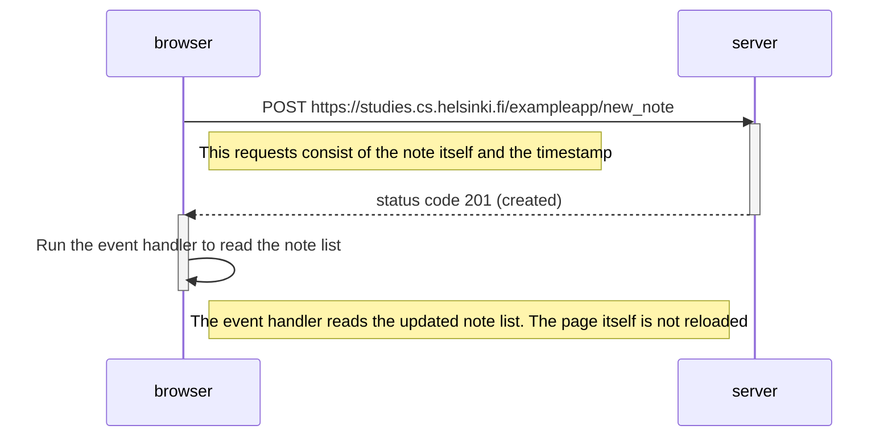

```mermaid
sequenceDiagram
    participant browser
    participant server

    browser->>server: POST https://studies.cs.helsinki.fi/exampleapp/new_note
    activate server
    Note right of browser: This requests consist of the note itself and the timestamp


    server-->>browser: status code 201 (created)
    deactivate server

    activate browser
    browser ->> browser: Run the event handler to read the note list
    deactivate browser

    Note right of browser: The event handler reads the updated note list. The page itself is not reloaded

```